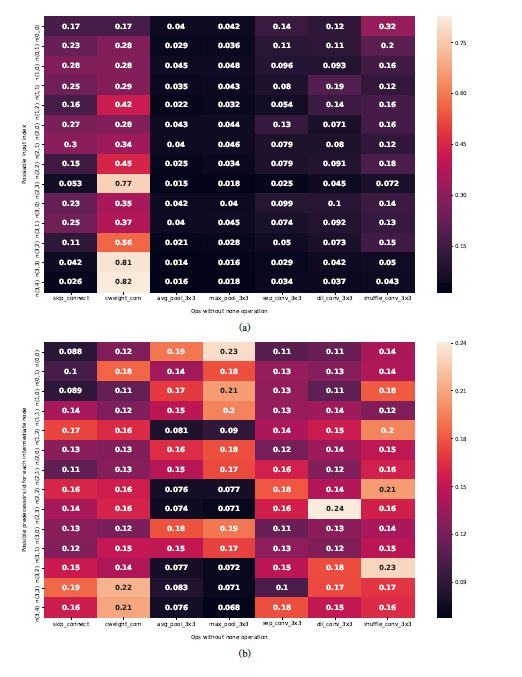

## CNAS 

Automatic Convolutional Neural Architecture Search for Image Classification under Different Scenes

Our work is based on [DARTS](https://arxiv.org/abs/1806.09055)

## 1. Requirements

+ Ubuntu14.04/16.04 or Window10 (Win7 may also support.)

+ Python >= 3.6

+ torch >= 0.4.1

+ torchvision == 0.2.1

+ seaborn (optional)

+ pygraphviz (optional)

NOTE: pytorch 0.4.x also work ok, but will meet [ConnectionResetError](https://github.com/pytorch/pytorch/issues/9127)
When use the second approximation. 

Todo:

- [ ] Merge into the CNASV prototype
- [ ] Replace the backbone network by automatically search outer network
- [ ] Give up the cell-based architecture for designing more flexible search space
- [ ] Merge this work to CNASV ( Search-Train Prototype for Computer Vision [CNASV](https://github.com/tianbaochou/CNASV))
 
## 2. Usage

```bash
pip3 install requirements.txt
```

**Notice**
> if you use win10, and want to show the cell architecture with graph, you 
need install the pygraphviz and add ```$workdir$\\3rd_tools\\graphviz-2.38\\bin```
into environment path. Here ```$workdir$``` is the custom work directory. such as ```E:\\workspace\\cnas``` 


> How to search:

```bash
python train_search.py --num-meta-node 4 --cutout --data '../data/cifar10'
```

> How to evaluate the CNN architecture we searched

+ run on multi gpus (gpu1, gpu2)
```bash
CUDA_VISIBLE_DEVICES=1,2  train_cnn.py --cutout  --multi-gpus
```

+ run on single gpus
we will find a max free memory gpus and run on it.
```bash
train_cnn.py --cutout  --multi-gpus
```


**Configure details**

> Notice:  num-meta-node, use-sparse and train-portion invalid in evaluate stage and 
multi-gpus, auxiliary and auxuliary-weight invalid in search stage

+ train-dataset ：the train dataset for search or train ('cifar10','cifar100', 'tiny-imagenet200')
+ data : the train dataset path ('../data/cifar10')
+ arch : the search arch name 
+ start-epoch:  manual epoch number (0) 
+ batch-size: the batch size (64)
+ num-meta-node: the number of intermediate nodes (4)
+ learning-rate: init learning rate (0.025)
+ learning-rate-min: minimize learning rate (0.003)
+ arch-learning-rate: learning rate for arch encoding
+ arch-weight-decay: weight decay for arch encoding
+ momentum: momentum for sgd (0.9)
+ weight-decay: weight decay (3e-4)
+ epochs: num of training epochs (60)
+ init-channels: num of init channels (16)
+ image-channels: num of image channels (3)
+ layers: total number of layers(cells) stacked for architecture in search stage
+ model-path: path to save the model (use for restart)
+ cutout: use cutout (False)
+ cutout-length: cutout length (16)
+ save: experiment name
+ resume: path to latest checkpoint (default: none)
+ grad-clip: gradient clipping (5)
+ train-portion: portion of training data (0.5)
+ sec-approx: use 2 order approximate validation loss (False)
+ use-sparse: use sparse framework (False)
+ multi-gpus: train network use multi-gpus 
+ auxiliary: use auxiliary tower (True)
+ auxuliary-weight: weight for auxiliary loss (0.4)
+ opt: optimizer (sgd)

## 3. Our works

+ We add the cweight operation (squeeze-and-excitation) and channel shuffle operation 
and remove 5x5 operation.

+ We allow to keep the none operation when derive the architecture and decode as sparse architecture.

+ We found the weights of our operations introduced is much higher than any others! (show in heat map below!)




